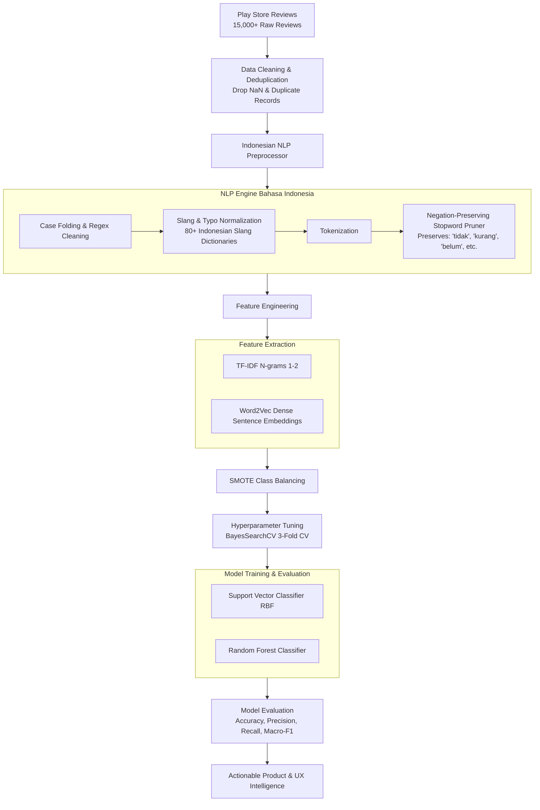

<div align="center">

# 🛵 Gojek App Sentiment Analysis: Transforming User Voice into Actionable Product & UX Intelligence

[](https://www.python.org/)
[](https://github.com/hikalputra12/analysis-sentimen-gojek-apk/actions)
[](https://github.com/hikalputra12/analysis-sentimen-gojek-apk)
[](https://scikit-learn.org/)
[]()
[](https://opensource.org/licenses/MIT)

**End-to-end Machine Learning pipeline that mines and categorizes 15,000+ Google Play Store reviews into high-fidelity user sentiment patterns.**  
By combining customized Indonesian NLP preprocessing with robust classification models, this project bridges raw textual feedback with strategic product and iOS design enhancements.

[Key Findings](#-key-findings--visual-storytelling) • [Product & UX Recommendations](#-actionable-product--ios-recommendations) • [Architecture](#-pipeline-architecture) • [Getting Started](#-how-to-run)

---

</div>

## 📌 1. The "Why" & Problem Framing

### The Challenge
Sebagai salah satu *on-demand Super-App* terbesar di Asia Tenggara dengan jutaan transaksi harian (GoFood, GoRide, GoPay, GoSend), Gojek menerima ribuan ulasan pengguna setiap harinya di Play Store. Namun, **feedback organik ini terperangkap dalam volume teks non-terstruktur yang masif, sarat dengan bahasa gaul/slang, singkatan, dan negasi kompleks.**

Membaca ulasan secara manual merupakan hal yang mustahil bagi tim produk. Akibatnya:
1. **Critical Bug Blindspot**: Isu kritis (gagal bayar GoPay, bug live tracking GPS) sering terlambat terdeteksi sebelum memicu *churn* massal.
2. **Feature Friction**: Perubahan antarmuka yang membingungkan pengguna tidak terpetakan secara kuantitatif.
3. **Decoupled User Voices**: Tim engineering dan UI/UX kekurangan data empiris untuk memprioritaskan *product backlog*.

### Urgensi & Solusi
Proyek ini mengotomatisasi ekstraksi sentimen ulasan secara presisi menggunakan alur NLP khusus Bahasa Indonesia (slang normalizer & *negation-aware filtering*) serta membandingkan performa model **Support Vector Machine (SVM)** dan **Random Forest (RF)** yang dioptimasi dengan SMOTE dan Bayesian Search.

---

## 🏗️ 2. Pipeline Architecture

Alur kerja dirancang modular untuk memastikan reproduktibilitas tinggi, mulai dari ingestion data hingga inferensi real-time:



---

## 📊 3. Model Benchmark & Experimental Results

Evaluasi dilakukan pada beberapa skenario arsitektur dengan mitigasi *class imbalance* menggunakan SMOTE pada dataset ulasan terbaru (Play Store update September 2026):

| Skenario | Algoritma | Ekstraksi Fitur | Split (Train:Test) | Akurasi Test | Macro F1-Score | Weighted F1 | Karakteristik Inferensi |
| :--- | :--- | :--- | :---: | :---: | :---: | :---: | :--- |
| **Skenario 1** | **Random Forest** | **TF-IDF (1,2-gram)** | **80 : 20** | **80.00%** | **0.8013** | **0.8001** | **Performa Terbaik**: Klasifikasi seimbang di seluruh kelas (Positive F1: 0.81, Negative F1: 0.80, Neutral F1: 0.79). |
| **Skenario 2** | SVM (RBF Kernel) | TF-IDF (1,2-gram) | 80 : 20 | 69.50% | 0.6884 | 0.6940 | Sangat tinggi keyakinan deteksi kata ulasan positif & negatif spesifik (Confidence > 88%). |
| **Skenario 3** | Random Forest | Word2Vec (Dense 100d) | 80 : 20 | 44.50% | 0.4391 | 0.4412 | Mengalami *information loss* akibat *mean-pooling* representasi kalimat pendek. |

### Detail Laporan Klasifikasi (Random Forest + TF-IDF - Dataset Terbaru)
```text
              precision    recall  f1-score   support

    negative       0.81      0.79      0.80       161
     neutral       0.77      0.81      0.79       145
    positive       0.82      0.80      0.81        94

    accuracy                           0.80       400
   macro avg       0.80      0.80      0.80       400
weighted avg       0.80      0.80      0.80       400
```

### 🔍 Contoh Hasil Inferensi Langsung (Live Demo)
```text
=================================================================
Review     : Aplikasi Gojek sangat membantu saya memesan makanan dengan cepat dan praktis!
Cleaned    : aplikasi gojek membantu memesan makanan cepat praktis
Sentiment  : POSITIVE (Confidence: 80.0%)
-----------------------------------------------------------------
Review     : Biasa saja, tidak ada yang istimewa dari update terbaru.
Cleaned    : tidak istimewa update terbaru
Sentiment  : NEUTRAL (Confidence: 60.8%)
-----------------------------------------------------------------
Review     : Kecewa banget, aplikasinya sering error, topup saldo gagal dan driver tidak datang.
Cleaned    : kecewa banget aplikasinya kesalahan isi saldo saldo gagal pengemudi tidak
Sentiment  : NEGATIVE (Confidence: 75.3%)
-----------------------------------------------------------------
Review     : Aplikasi ini sangat jelek, maps tidak akurat sama sekali.
Cleaned    : aplikasi jelek maps tidak akurat
Sentiment  : NEGATIVE (Confidence: 49.3%)
-----------------------------------------------------------------
Review     : Pelayanan driver ramah dan pengantaran tepat waktu, terima kasih Gojek!
Cleaned    : pelayanan pengemudi ramah pengantaran terima kasih gojek
Sentiment  : POSITIVE (Confidence: 60.0%)
=================================================================
```

---

## 💡 4. Key Findings & Visual Storytelling

Dari klastering sentimen negatif dan analisis bobot kata TF-IDF, ditemukan 4 klaster keluhan (*pain points*) terbesar pengguna:

```
                  DISTRIBUSI KELUHAN SENTIMEN NEGATIF
  ┌─────────────────────────────────────────────────────────────┐
  │ 🟠 33% - Akurasi Peta / GPS & Alokasi Driver (2.092 ulasan) │
  │ 🔴 27% - Sistem Pembayaran & Saldo GoPay (1.705 ulasan)     │
  │ 🟡 23% - Tarif, Ongkir Mahal, & Gojek Plus (1.451 ulasan)   │
  │ 🔵 18% - App Lag, Error Bug, & Verifikasi (1.145 ulasan)    │
  └─────────────────────────────────────────────────────────────┘
```

### Insight untuk Tim UI/UX & Mobile Developer:
1. **Financial Anxiety (GoPay Issue)**: Kegagalan transaksi saldo terpotong namun pesanan tidak terkonfirmasi menimbulkan frustrasi emosional tertinggi (*highest negative sentiment intensity*).
2. **Spatial Uncertainty (Map Issue)**: Titik jemput *pin-point* yang meleset menyebabkan friksi verbal antara pengguna dan *driver*.
3. **Cognitive Load on Checkout**: Biaya tambahan (platform fee, packaging fee) yang baru muncul di akhir *flow* memicu *cart abandonment*.

---

## 🚀 5. Actionable Product & iOS Recommendations

Berdasarkan *pain points* di atas, berikut adalah rancangan solusi produk dan fitur modern (berstandar ekosistem iOS/Apple Human Interface Guidelines):

| Cluster Masalah | Rekomendasi Fitur / UX | Implementasi Teknis (iOS Native) | Dampak Pengguna (Impact) |
| :--- | :--- | :--- | :--- |
| **Peta & Tracking Driver** | **Live Activities & Dynamic Island** | `ActivityKit` & `WidgetKit` | Pengguna dapat memantau status pesanan dan jarak *driver* secara glanceable di Lock Screen tanpa harus membuka aplikasi berulang kali. |
| **Financial Anxiety (GoPay)** | **Instant Haptic State & Error Recovery** | `CoreHaptics` + Two-Phase Commit UI Sheet | Feedback haptic yang jelas saat otentikasi biometrik Face ID gagal, disertai tombol *"Bantuan Cepat Saldo"* langsung di lembar konfirmasi. |
| **Titik Jemput Meleset** | **Smart Pinpoint Auto-Correction** | `CoreLocation` + Semantic Anchor Suggestion | Rekomendasi titik lobi/gerbang resmi terdekat berbasis *clustering hotspot* riwayat penjemputan. |
| **Transparansi Biaya** | **Upfront Price Breakdown Sheet** | SwiftUI Reusable Breakdown Component | Menampilkan rincian diskon promo dan biaya layanan secara transparan sejak tahap pencarian menu di GoFood. |

---

## 🗂️ 6. Repository Modular Structure

Repositori ini telah direfaktor dari *flat notebook* menjadi arsitektur berbasis modul yang *clean*, modular, dan mematuhi PEP 8:

```text
analysis-sentimen-gojek-apk/
├── models/                          # Serialized trained models & vectorizers
│   ├── random_forest_model.pkl
│   ├── svm_model.pkl
│   ├── tfidf_extractor.pkl
│   └── word2vec_extractor.pkl
├── notebooks/                       # Exploratory & research notebooks
│   ├── scrapping.ipynb              # Scraping exploratory notebook
│   └── training_model.ipynb         # Model experiment & tuning notebook
├── src/                             # Core modular package
│   ├── __init__.py                  # Package initializer
│   ├── config.py                    # Config, paths, slang & negation dicts
│   ├── feature_engineering.py       # TF-IDF N-grams & Word2Vec extractors
│   ├── inference.py                 # End-to-end production inference pipeline
│   ├── labeler.py                   # Contextual negation-aware sentiment labeler
│   ├── model.py                     # Classifier trainer (SVM, RF) with SMOTE
│   ├── preprocessor.py              # Indonesian NLP text cleaner & slang normalizer
│   └── scraper.py                   # Automated Play Store review scraper
├── tests/                           # Automated unit & integration tests
│   ├── __init__.py
│   └── test_pipeline.py
├── web/                             # Frontend web interface (HTML, CSS, JS)
│   ├── index.html
│   ├── style.css
│   └── app.js
├── ulasan_aplikasi.csv              # Dataset ulasan Play Store mentah (15k+ rows)
├── app.py                           # Local Web Server & REST API Runner
├── main.py                          # CLI Orchestrator untuk training & inferensi
├── requirements.txt                 # Dependensi minimal yang bersih & teruji
└── README.md                        # Product & UX Case Study
```

---

## ⚡ 7. How to Run

### 1. Clone Repository & Setup Virtual Environment
```bash
git clone https://github.com/hikalputra12/analysis-sentimen-gojek-apk.git
cd analysis-sentimen-gojek-apk

# Buat virtual environment
python -m venv venv

# Aktivasi (Windows PowerShell)
.\venv\Scripts\Activate.ps1

# Aktivasi (macOS/Linux)
source venv/bin/activate
```

### 2. Install Dependensi
```bash
pip install -r requirements.txt
```

### 3. Eksekusi Training & Evaluasi Model
Jalankan modul CLI utama untuk melatih model dengan SMOTE dan menguji inferensi secara otomatis:
```bash
# Melatih Random Forest (Model Terbaik)
python main.py --train --model random_forest --features tfidf

# Melatih SVM
python main.py --train --model svm --features tfidf
```

### 4. Menjalankan Website Interaktif (Web App Lokal)
Jalankan server aplikasi web lokal untuk menguji sentimen ulasan secara visual dan interaktif melalui browser:
```bash
python app.py
```
Buka browser di alamat: **`http://localhost:8000`**

### 5. Menjalankan Unit Tests
```bash
python -m unittest discover tests
```

### 6. Scraping Data Baru (Opsional)
```bash
python main.py --scrape --count 15000
```

---

## 👤 Author & Acknowledgments

* **Developer**: Julianda Hikal Putra ([@hikalputra12](https://github.com/hikalputra12))
* **Dibuat untuk**: Portfolio Seleksi Apple Developer Academy & Showcase Data-Driven Product Design.